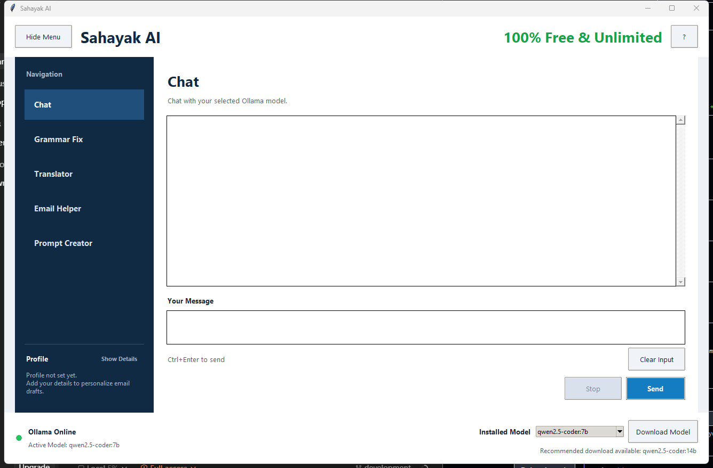

# Sahayak AI

Sahayak AI is a desktop productivity assistant built with Python, Tkinter, and Ollama. It runs local AI tools from a single window and is designed to stay simple, private, and easy to launch on Windows.



## What It Includes

- Chat with a local Ollama model
- Grammar and spelling correction
- Translator with source and target language selection
- Professional email drafting helper
- Prompt creator with category-aware structured responses
- In-app help center with setup and usage guidance from the `?` button
- Tooltips across the UI for faster onboarding
- Collapsible left navigation and collapsible profile details panel
- Live Ollama status indicator and installed-model selector
- In-app profile storage for email signatures and personalization
- Double-click launchers for easier opening

## Required Components

Before running Sahayak AI, make sure these components are available:

1. Python 3.10 or newer
2. `pip`
3. Tkinter
   On standard Windows Python installers, Tkinter is usually included by default.
4. Ollama installed and running locally
   Download from [https://ollama.com/download](https://ollama.com/download)
5. At least one Ollama model installed
   Recommended model: `qwen2.5-coder:14b`
   The app can still work with another installed local model if `14b` is not yet available.

## Initial Setup

1. Clone the repository:

```bash
git clone https://github.com/chitrang313/Sahayak-AI.git
cd Sahayak-AI
```

2. Create and activate a virtual environment:

```bash
python -m venv .venv
.venv\\Scripts\\activate
```

3. Install Python dependencies:

```bash
pip install -r requirements.txt
```

4. Start Ollama if it is not already running.

5. Pull a recommended model:

```bash
ollama pull qwen2.5-coder:14b
```

If you only want a smaller model first, you can pull:

```bash
ollama pull qwen2.5-coder:7b
```

## Ways To Open The App

### Option 1: Double-click launcher

Use either of these files from the project root:

- `Sahayak AI.pyw`
- `Launch Sahayak AI.bat`

For most Windows setups:

- `Sahayak AI.pyw` opens the app without a console window
- `Launch Sahayak AI.bat` is a fallback launcher that tries `.venv`, `pyw`, `py`, or `python`
- `Create Desktop Shortcut.ps1` creates a desktop shortcut named `Sahayak AI`

### Option 2: Run from terminal

```bash
python main.py
```

## First-Time Configuration Inside The App

When the app opens for the first time:

1. Check the bottom-left status indicator
   Green dot means Ollama is online
   Red dot means Ollama is offline

2. Check the installed model dropdown at the bottom-right
   It only shows models that are installed on your system

3. If `qwen2.5-coder:14b` is not installed, use the `Download Model` button
   The button hides automatically after that preferred model is installed
   Download progress and cancel controls appear while the model is being pulled

4. Use the `?` button at the top-right any time you want in-app setup help or feature usage guidance

5. Fill in the left-side profile section if you want email outputs to use your details:
   - Your Full Name
   - Your Email Address
   - Your Phone Number
   - LinkedIn Profile

6. Click `Save Profile`

You can collapse the menu or the profile detail section whenever you want more working space.

Profile data is stored locally in `user_profile.json`, which is ignored by git and not committed to the repository.

## How To Use Each Feature

### Chat

- Open `Chat` from the left navigation
- Type your message
- Press `Send` or use `Ctrl + Enter`
- Assistant replies are shown under `Sahayak say:`
- Use `Stop` to cancel the running request

### Grammar Fix

- Paste or type text into the input box
- Click `Correct`
- Edit the generated output if needed
- Use `Copy Text` to copy the corrected result

### Translator

- Enter the source text
- Choose `From` and `To` languages
- Click `Translate`
- Use `Copy Text` to copy the translated result
- Output is editable if you want to refine the translation manually

### Email Helper

- Select recipient title
- Enter recipient name
- Enter subject
- Choose response length:
  - Short response message
  - Mid response message
  - Long response message
- Add your purpose/details
- Click `Generate`
- Edit or copy the output as needed

### Prompt Creator

- Select a category
- Choose response length
- Enter your request
- Click `Generate`
- Edit or copy the generated response

## Project Structure

```text
Sahayak-AI/
|-- main.py
|-- Sahayak AI.pyw
|-- Launch Sahayak AI.bat
|-- Create Desktop Shortcut.ps1
|-- requirements.txt
|-- services/
|   |-- ollama_service.py
|   `-- prompt_builder.py
|-- ui/
|   |-- layout.py
|   |-- chat_ui.py
|   |-- grammar_ui.py
|   |-- translator_ui.py
|   |-- email_ui.py
|   |-- prompt_ui.py
|   `-- common.py
|-- utils/
|   |-- status_checker.py
|   |-- clipboard.py
|   `-- profile_store.py
`-- assets/
    `-- screenshots/
        `-- sahayak-ai-app.png
```

## Troubleshooting

### Ollama is offline

- Start Ollama manually
- Check whether `http://localhost:11434` is reachable

### No model appears in the dropdown

- Install at least one model:

```bash
ollama pull qwen2.5-coder:7b
```

### Download button fails

- Confirm `ollama` works in terminal:

```bash
ollama list
```

- If the command is not found, reinstall Ollama or restart the terminal/session

### App does not open on double-click

- Try `Launch Sahayak AI.bat`
- If needed, launch from terminal with:

```bash
python main.py
```

## Notes

- The app is designed around a local-first workflow
- Responses depend on the selected installed Ollama model
- Larger models may require more RAM and disk space
- The preferred experience is with `qwen2.5-coder:14b`, but installed fallback models are also supported
- The latest UI includes a built-in help center, tooltip hints, and better collapsible workspace controls
